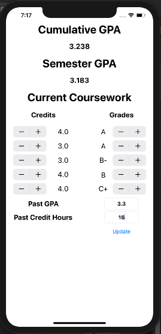
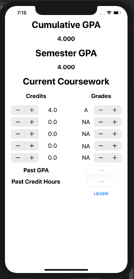

# notAnotherGpaCalculator
iOS GPA Calculator

This is a simple GPA calculator written in Swift using Xcode 11.  The user can select credit hours and grade received for up to five classes.  To select fewer than five classes, simply set credit hours to "0.0" or grade to "NA".  The resulting GPA is displayed at the top of the screen.

