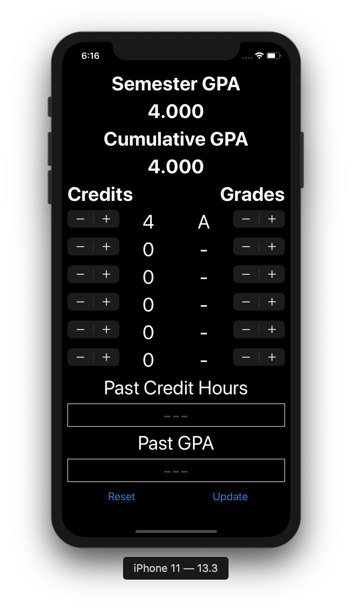
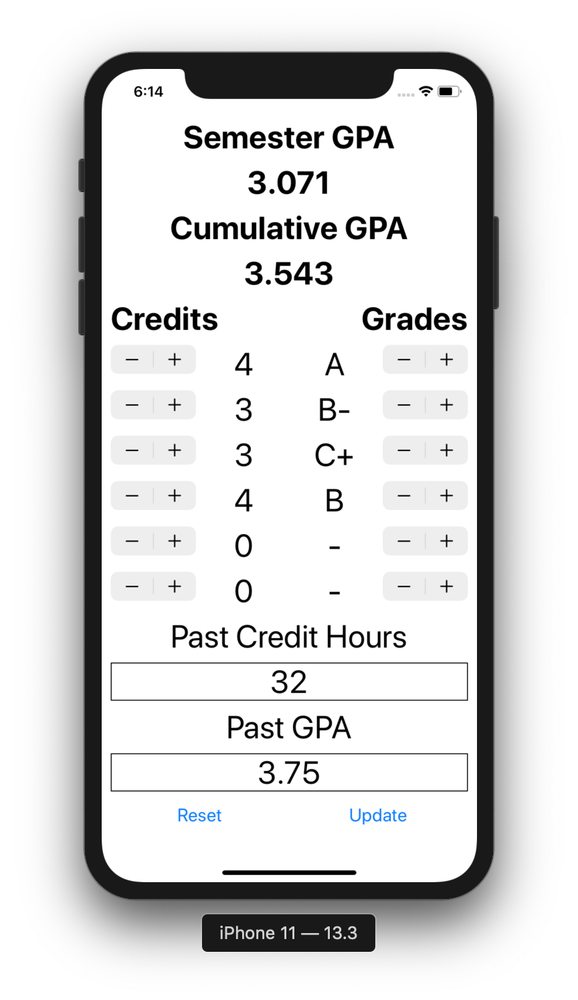

# fastGPA
iOS GPA Calculator

This is a very simple GPA calculator written in Swift using Xcode 11.  The user can select credit hours and grade received for up to six classes.  To select fewer than six classes, simply set credit hours to "0" or grade to "-".  The resulting GPA is displayed at the top of the screen.  The user can also choose to enter their previous GPA and previous credit hours earned to see the effect that their semester work will have on their cumulative GPA.

<table>
  <tr>
    <td style="padding:5px">
      
    </td>
    <td style="padding:5px">
      
    </td>
  </tr>
<table>
